# Rowing Manager

A Qt6/C++ desktop application for managing rowing club session assignments.
Boats are filled automatically while respecting skill levels, compatibility,
propulsion ability, blacklists, groups, equipment availability, stroke length,
body size, co-occurrence history, and more.

---

## Part 1 — User Guide

### Getting started

Open the application. The main window has eight tabs: **Boats**, **Rowers**,
**Assignments**, **Distance**, **Dist. Detail**, **Statistics**, and **Options**.
Work through them from left to right the first time you set up a club.

---

### Boats tab

Add every boat the club owns with **＋ Add Boat** or **Ctrl+N**.

| Column | What to enter |
|---|---|
| Name | Free text, e.g. "DF" |
| Type | Gig or Racing |
| Cap | Number of rowing seats (1–5). Does **not** count the foot-steerer. |
| Steering | **Foot-Steered** = a dedicated foot-steerer sits in the boat. **Hand-Steered** = rowers steer themselves, no steerer needed. |
| Propulsion | **Scull** = two oars per rower. **Sweep** = one oar per rower. |

Default for new boats: Foot-Steered, Scull.

---

### Rowers tab

Add every club member with **＋ Add Rower** or **Ctrl+N**.

| Column | What to enter |
|---|---|
| Name | Full name |
| Skill | Student → Beginner → Experienced → Professional |
| Compat | See compatibility section below |
| Foot Steerer | ✓ if this person can operate foot-steering |
| Obmann | ✓ if this person is eligible to lead a boat |
| Propulsion | Scull / Sweep / Both |
| Age Band | Decade range (20-30, 30-40, …). Used for role weighting. |
| Strength | 0 (not set) to 10. Balanced across boats with capacity > 2. |
| Stroke Length | Short / Medium / Long. Matched within boats; strict for 2-seat boats. |
| Body Size | Small / Medium / Tall. Matched within boats; strict for 2-seat boats. |
| Attr 3 | Generic numeric attribute 0–10 (technique, fitness, etc.) |
| Grp Attr 1 / 2 | Group attributes 0–10. People with the **same** value are preferred together. |
| Val Attr 1 / 2 | Balance attributes 0–10. Average is balanced **across** boats (cap > 2). |

**Compatibility tiers:**
- **Infinite** — rows happily with anyone, never penalised
- **Normal** — standard; no penalty with anyone
- **Special** — mild preference to stay with Normal/Infinite; soft penalty with other Specials, hard block with Selected
- **Selected** — hard block with Special in strict mode; fine with everyone else

**Rower Whitelist / Blacklist** — click the buttons in the toolbar.
A whitelist gives a bonus score when those people end up in the same boat.
A blacklist is a hard constraint: those two people will never be in the same boat.

**Boat Whitelist** — if non-empty, this rower will **only** be placed in one of
the listed boats. Leave empty for no preference.

**Boat Blacklist** — this rower will never be placed in any of the listed boats.
Both are hard constraints enforced by the generator before any scoring.

---

### Options tab

**Equipment limits** — enter the number of oars physically available.
Set 0 for no limit. One scull oar is counted per rower in a scull boat; one sweep
oar per rower in a sweep boat. If selected boats would exceed the available count,
generation is blocked and the shortfall is shown.

**Sick / Unavailable** — check the box next to any rower who is absent today.
Sick rowers are excluded from all generation and selection lists until unchecked.
They still appear in Statistics and Distance history.

---

### Creating an assignment

Click **🎲 New** on the Assignments tab. A dialog opens with four tabs.

**Tab 1 — Groups**
Create named groups of people who must share a boat. Optionally pin the group
to a specific boat. If you pin a group to a boat, the label shows `(members/capacity)`
so you can see how many seats remain for the generator to fill.
You cannot add more members to a group than its pinned boat can hold.
If the group is smaller than the boat's capacity, the generator fills the remaining seats.

**Tab 2 — Boats & Rowers**
Check which boats and rowers to include. Enable **"Select boats automatically"**
to let the application pick boats that exactly match the number of checked rowers,
respecting equipment limits.

**Tab 3 — Priority**
Drag the five factors (Skill, Compatibility, Propulsion, Stroke Length, Body Size)
into the order that matters most today. The top item is weighted 4×, second 2×, third 1×,
and further items 0.5×.

- **Training mode** — ignores Skill and Compatibility entirely; only Propulsion,
  Whitelist, and Attribute closeness are used.
- **Crazy mode** — ignores everything. Pure random shuffle.

**Tab 4 — Options**
Add **Steering-only people**: riders who sit in a boat but do not occupy a rowing
seat. They are not counted against capacity. You can pin them to a specific boat.
Equipment limits are configured globally in the main Options tab.

Click **Check** to see any issues before generating.
Click **Generate**. If it fails, a full diagnostic appears in the preview panel.
Click **Accept & Save** to store the result.

The preview panel has two tabs: **Text** (monospace, default) and **Table**
(Excel-style, one column per boat).

---

### Assignment list

Each saved assignment shows its name and date. A **🔒** prefix means the assignment
is locked. Click **🔒 Lock** to toggle — locked assignments cannot be edited via
double-click until unlocked.

---

### Distance tab

Select an assignment from the dropdown. Enter the kilometres rowed by any one
person in a boat — the application auto-fills the same value for all other rowers
**in the same boat** (not the whole assignment, since different boats may cover
different distances). You can then adjust individual values freely.

---

### Dist. Detail tab

Grid of rowers × last 14 assignments. Assignment names are rotated in the column
headers to save space. The rightmost column shows each rower's total km.
Click **Refresh** to reload.

---

### Statistics tab

Shows lifetime totals and "last 3 sessions" counts for Obmann duty, Steering duty,
and total kilometres rowed. Rowers with 3 or more appearances in either role in
the last three sessions are flagged as "overused" — the generator automatically
reduces their weighting for those roles next time.

---

### Printing

Select an assignment and click **Print**. The application auto-detects a connected
Epson receipt printer via USB. The small **x** spinbox to the left defaults to the
number of boats in the assignment (one slip per boat crew). You can reduce it.
If no printer is found, a dialog explains the reason and what driver may be needed.

---

---

## Part 2 — Developer & Expert Reference

### Architecture overview

```
main.cpp
└── MainWindow  (mainwindow.h/.cpp)
    ├── BoatTableModel      (boattablemodel.h/.cpp)
    ├── RowerTableModel     (rowertablemodel.h/.cpp)
    ├── DatabaseManager     (databasemanager.h/.cpp)
    ├── AssignmentDialog    (assignmentdialog.h/.cpp)
    │   └── AssignmentGenerator (assignmentgenerator.h/.cpp)
    └── PrinterDevice       (printerdevice.h/.cpp)
```

Data classes: `Boat`, `Rower`, `Assignment` (with `SavedGroup`).
All persistence is SQLite via Qt's `QSqlDatabase`. The DB file is created
in the application's working directory as `rowing_manager.db`.

---

### Data model

#### Boat

```cpp
enum class BoatType    { Gig, Racing };
enum class SteeringType{ Steered,    // Foot-Steered — needs a canSteer person
                         NonSteered  // Hand-Steered — no steerer needed
                       };
enum class PropulsionType { Skull,   // stored as "Scull" in display
                            Riemen,  // stored as "Sweep" in display
                            Both };
```

`steeringTypeFromString()` accepts both old names (`"Steered"`, `"Non-Steered"`)
and new names (`"Foot-Steered"`, `"Hand-Steered"`) for DB backward compatibility.
`propulsionTypeFromString()` likewise accepts `"Skull"/"Scull"` and `"Riemen"/"Sweep"`.

Default new boat: `SteeringType::Steered`, `PropulsionType::Skull`.

#### Rower

Fields relevant to generation logic:

| Field | Type | Generation role |
|---|---|---|
| `skill` | `SkillLevel` (0–3) | Scoring, Racing-boat hard constraint |
| `compatibility` | `CompatibilityTier` (0–3) | Hard constraint & soft penalty |
| `canSteer` | bool | Required for Foot-Steered boats (hard) |
| `isObmann` | bool | +20.0 bonus when present in boat (cap > 2) |
| `propulsionAbility` | `PropulsionType` | Hard constraint |
| `ageBand` | int (lower decade) | Obmann / Steerer role weighting |
| `strength` | int 0–10 | Strength-variance balancing (cap > 2) |
| `strokeLength` | int 0–3 (Short/Med/Long) | Pairwise matching penalty |
| `bodySize` | int 0–3 (Small/Med/Tall) | Pairwise matching penalty |
| `attr3` | int 0–10 | Generic variance balancing |
| `attrGrp1/2` | int 0–10 | Group-together bonus (+3 per matching pair) |
| `attrVal1/2` | int 0–10 | Balance-across-boats penalty (cap > 2) |
| `whitelist` | `QList<int>` rowerId | +5.0 per matched pair in same boat |
| `blacklist` | `QList<int>` rowerId | Hard bidirectional constraint |
| `boatWhitelist` | `QList<int>` boatId | Hard: only eligible for listed boats |
| `boatBlacklist` | `QList<int>` boatId | Hard: never placed in listed boats |

Skill integer mapping: Student=1, Beginner=2, Experienced=3, Professional=4.

#### Assignment

| Field | Purpose |
|---|---|
| `boatRowerMap` | `QMap<int boatId, QList<int> rowerIds>` — the core result |
| `locked` | bool — prevents editing when true |
| `groups` | `QList<SavedGroup>` — persisted dialog group state for restore |
| `checkedBoatIds / checkedRowerIds` | Tab 2 state for restore |
| `priorityOrder` | Serialised priority list including `"__training__"` / `"__crazy__"` tokens |

---

### Database schema

```sql
boats            (id, name, type, capacity, steering_type, propulsion_type)
rowers           (id, name, skill, compatibility, can_steer, is_obmann,
                  propulsion_ability, age_band, strength,
                  stroke_length, body_size, attr3,
                  attr_grp1, attr_grp2, attr_val1, attr_val2,
                  whitelist, blacklist, boat_whitelist, boat_blacklist)
assignments      (id, name, created_at, details TEXT, locked INTEGER)
assignment_entries  (id, assignment_id, boat_id, rower_id)
assignment_roles    (id, assignment_id, boat_id, rower_id, role)
                    -- role: "obmann" | "steering" | "obmann_steering"
rower_distances     (id, assignment_id, rower_id, km)
sick_rowers         (rower_id)
```

All new columns are added via `ALTER TABLE ADD COLUMN` (idempotent, ignored on
already-upgraded databases). String parsers always accept both old and new display names.

---

### Generation algorithm

#### Entry point: `AssignmentGenerator::generate()`

1. Validates `selectedRowers.size() >= totalCapacity`. Fails fast if not.
2. **Crazy mode** short-circuit: Fisher-Yates shuffle, fill boats by capacity, return immediately.
3. **Normal mode — three-pass graceful degradation:**

| Pass | `relaxCompat` | Constraints relaxed |
|---|---|---|
| 0 | false | All constraints active |
| 1 | true | Compat hard-block and Racing/Beginner block lifted |
| 2 | true (relaxAll) | Pass 1 + steerer requirement dropped if unavailable |

Each pass runs **15 full-assignment attempts**. First successful attempt ends the pass.

**Partial pinned groups:** if a group fills only some seats of its pinned boat,
the boat is passed to the generator with a reduced capacity equal to the remaining
seats, and the group members are pre-seeded into `preSeeded` before the generator runs.

#### `fillBoat()` — inner loop

1. Pre-check: available rowers ≥ capacity; foot-steerer present if needed.
2. **600 shuffle attempts** (Fisher-Yates):
   - Even attempts: pre-seed a random `canSteer` rower first.
   - Greedily add rowers while `!violatesConstraints()`.
   - Discard if candidate too small or missing steerer.
   - Score via `scoreTeam()`. Keep best across all 600 attempts.
3. Commit best team; remove from `availableRowerIds`.

#### `violatesConstraints()` — hard rules (checked in every attempt)

| Rule | Always active | Notes |
|---|---|---|
| **Boat blacklist** | Yes | Rower refuses this specific boat |
| **Boat whitelist** | Yes | If non-empty, rower is ineligible for unlisted boats |
| **Rower blacklist** | Yes | Bidirectional; rejects if either party blacklists the other |
| **Propulsion** | Yes | `propulsionAbility` must match boat's `propulsionType` |
| **Compat hard-block** | Pass 0 only | `Special` + `Selected` → reject |
| **Racing/Beginner** | Pass 0 only | Student or Beginner → reject for Racing boats |

---

### `scoreTeam()` — complete scoring formula

Higher score = better team. Generator keeps the highest-scoring team across 600 attempts.

```
score =
  + wSkill  × (avgSkill + skillBalance)          // skill level and balance
  + wCompat × (−compatPenaltyTotal)              // compatibility tension
  + wProp   × avgProp × 3.0                      // propulsion match
  − attrVariance × 0.5                           // attr3 spread within team
  − strengthVariance × 0.3                       // strength spread (cap > 2)
  + whitelistBonus                               // +5.0 per whitelist pair
  − racingBeginnerPenalty                        // −8.0 per beginner in Racing
  + obmannBonus                                  // +20.0 if ≥1 Obmann in team (cap > 2)
  − strokePenalty                                // stroke length mismatch
  − bodyPenalty                                  // body size mismatch
  + grpBonus                                     // +3.0 per matching GrpAttr pair
  − valPenalty                                   // ValAttr variance (cap > 2)
  − coOccurrencePenalty                          // −1.5 × past co-occurrences per pair
```

**Training mode** replaces the `wSkill/wCompat/wProp` terms with just
`−attrVariance + whitelistBonus + avgProp × 3.0`, keeping all other terms.

**Weight decay:** the priority list maps to weights `[4.0, 2.0, 1.0, 0.5, 0.5]`
for factors at positions 1–5. StrokeLength and BodySize participate in the ordered
list alongside Skill, Compatibility, and Propulsion.

#### Detailed term definitions

| Term | Formula | Notes |
|---|---|---|
| `avgSkill` | mean of `skillToInt()` | Student=1 … Professional=4 |
| `skillBalance` | `−variance(skillVals) / N` | Less spread = higher score |
| `compatPenaltyTotal` | sum of pairwise `compatPenalty(a,b)` | See table below |
| `avgProp` | mean per-rower match: exact=1.0, Both=0.5, mismatch=0.0 | |
| `attrVariance` | variance of `attr3` values (0 excluded) | |
| `strengthVariance` | variance of `strength` values (0 excluded, cap>2 only) | |
| `whitelistBonus` | +5.0 per whitelist pair in same team | |
| `racingBeginnerPenalty` | +8.0 per Student/Beginner in Racing boat | all passes |
| `obmannBonus` | +20.0 if any `isObmann` rower in team | cap > 2 only |
| `strokePenalty` | pairwise gap-based (see below) | |
| `bodyPenalty` | pairwise gap-based (see below) | |
| `grpBonus` | +3.0 per matching pair in GrpAttr1, +3.0 in GrpAttr2 | |
| `valPenalty` | `variance(attrVal1)/N × 0.4 + variance(attrVal2)/N × 0.4` | cap > 2 |
| `coOccurrencePenalty` | `−1.5 × count` per pair | count from all past assignments |

#### Stroke length penalty (per pair)

| Boat capacity | Gap = 0 | Gap = 1 | Gap = 2 |
|---|---|---|---|
| ≤ 2 | 0.0 | −3.0 | −12.0 |
| > 2 | 0.0 | −2.5 | −5.0 |

#### Body size penalty (per pair)

| Boat capacity | Gap = 0 | Gap = 1 | Gap = 2 |
|---|---|---|---|
| ≤ 2 | 0.0 | −1.5 | −8.0 |
| > 2 | 0.0 | −1.0 | −2.0 |

#### Compatibility penalty table (`compatPenalty(a, b)`)

| Pair | Penalty |
|---|---|
| Either is Infinite | 0.0 |
| Either is Normal | 0.0 |
| Special + Special | 2.0 |
| Special + Selected | 4.0 (also hard block in pass 0) |
| Selected + Selected | 0.0 |

---

### Role assignment (Obmann / Steering)

Roles are computed **once** on first display and persisted to `assignment_roles`.
Subsequent clicks read saved roles — no re-randomisation.

Only boats with `capacity > 2` receive role designations.

**Obmann scoring:** `ageBand × 0.5 − recentObmannCount × 3.0`
(returns −1e9 if `isObmann == false`; falls back to random pick if no qualified candidate)

**Steerer scoring:** `(100 − effectiveBand) × 0.3 − recentSteeringCount × 3.0`
(returns −1e9 if `canSteer == false`; `effectiveBand` defaults to 50 if unknown)

One person can hold both roles simultaneously — stored as `"obmann_steering"`.

---

### Check logic (`runChecks()`)

| Check | On fail |
|---|---|
| Group capacity overflow | Hard block in Generate |
| Equipment limits exceeded | Hard block + Generate button disabled |
| Seat count mismatch | Hard block in Generate |
| No Obmann for cap>2 boat | Warning only (generator still runs) |
| Foot-steerer shortage | Warning (generator tries relaxed passes) |
| Propulsion mismatch | Warning |
| Beginners in Racing boats | Warning |

---

### Co-occurrence tracking

`DatabaseManager::loadCoOccurrence()` runs a self-join on `assignment_entries`:

```sql
SELECT ae1.rower_id, ae2.rower_id
FROM assignment_entries ae1
JOIN assignment_entries ae2
  ON ae1.assignment_id = ae2.assignment_id
  AND ae1.boat_id = ae2.boat_id
  AND ae1.rower_id < ae2.rower_id
```

The result is a `QMap<QPair<int,int>, int>` (pair → count) passed into
`ScoringPriority::coOccurrence`. Each pair that has shared a boat N times
receives `−1.5 × N` in `scoreTeam`, creating a soft pressure to mix up
combinations over successive sessions without blocking anything.

---

### Assignment locking

`Assignment::isLocked()` maps to the `locked INTEGER` column in `assignments`.
`DatabaseManager::setAssignmentLocked(id, bool)` performs a targeted `UPDATE`
without touching the rest of the record. The list item shows a 🔒 prefix.
`onEditAssignment()` returns early with a status message if the selected assignment is locked.

---

### Sick rower flow

1. User checks rower in **Options → Sick / Unavailable**.
2. `m_db->setSickRower(rowerId, true)` writes to `sick_rowers`.
3. `m_sickRowerIds` updated in memory.
4. Both `onNewAssignment` and `onEditAssignment` build `healthyRowers` by filtering out sick IDs before passing to `AssignmentDialog`.

---

### Distance pre-fill rule

`onDistanceChanged()` auto-fills only rowers sharing `Qt::UserRole + 2` (boatId)
within the same assignment. Rowers already at non-zero km are never overwritten.

---

### Printer integration

`PrinterDevice` uses `libusb-1.0` for direct USB bulk transfer to Epson ESC/POS printers.

Connection: try known VID/PID table → scan all devices by vendor → claim interface → find bulk-OUT endpoint → send ESC/POS init.

Print: umlaut substitution → Latin-1 encode → bulk write → `GS V 0` (cut).

`onPrintAssignment()` loops `m_printCopiesSpinBox->value()` times. Default = number of boats.

---

### Build system

```cmake
find_package(Qt6 REQUIRED COMPONENTS Core Widgets Sql)
find_package(PkgConfig REQUIRED)
pkg_check_modules(LIBUSB REQUIRED libusb-1.0)
```

Nix: add `pkgs.libusb1` to `buildInputs`. Linux USB access requires a udev rule:

```
SUBSYSTEM=="usb", ATTRS{idVendor}=="04b8", MODE="0666"
```

---

## Appendix — Scoring Penalty Map

```mermaid
flowchart TD
    T["scoreTeam(team, boat, priority)"]

    T --> SK["Skill\n+wSkill × (avgSkill + skillBalance)\nwSkill = 4/2/1/0.5 by priority rank"]
    T --> CO["Compatibility\n+wCompat × (−totalPenalty)\nSpecial+Special: −2\nSpecial+Selected: −4 ⚠ hard block pass 0"]
    T --> PR["Propulsion\n+wProp × avgProp × 3.0\nexact=1.0 / Both=0.5 / mismatch=0.0"]
    T --> WL["Whitelist bonus\n+5.0 per pair in same boat"]
    T --> OB["Obmann bonus\n+20.0 if ≥1 Obmann in team\nonly when capacity > 2"]
    T --> RB["Racing/Beginner penalty\n−8.0 per Student or Beginner\nin a Racing boat\n(all passes)"]
    T --> ST["Strength variance\n−0.3 × variance\n0-valued excluded\nonly cap > 2"]
    T --> A3["Attr3 variance\n−0.5 × variance\n0-valued excluded"]

    T --> SL["Stroke Length penalty\nper pair (gap-based)\ncap ≤ 2: gap1=−3 gap2=−12\ncap > 2: gap1=−2.5 gap2=−5"]
    T --> BS["Body Size penalty\nper pair (gap-based)\ncap ≤ 2: gap1=−1.5 gap2=−8\ncap > 2: gap1=−1 gap2=−2"]

    T --> GA["GrpAttr bonus\n+3.0 per pair with same\nnon-zero GrpAttr1 or GrpAttr2"]
    T --> VA["ValAttr penalty\n−0.4 × variance(ValAttr1)\n−0.4 × variance(ValAttr2)\nonly cap > 2"]

    T --> CC["Co-occurrence penalty\n−1.5 × N per pair\nN = times rowed together\nacross all past assignments"]

    T --> BL["Boat blacklist\nhard reject ⛔\n(violatesConstraints)"]
    T --> BWL["Boat whitelist\nhard reject if boat\nnot in list ⛔\n(violatesConstraints)"]
    T --> RL["Rower blacklist\nbidirectional hard reject ⛔\n(violatesConstraints)"]

    style OB fill:#2a4a1a,color:#aaffaa
    style WL fill:#2a4a1a,color:#aaffaa
    style GA fill:#2a4a1a,color:#aaffaa
    style SK fill:#1a2a4a,color:#aaaaff
    style CO fill:#1a2a4a,color:#aaaaff
    style PR fill:#1a2a4a,color:#aaaaff
    style RB fill:#4a1a1a,color:#ffaaaa
    style ST fill:#4a2a1a,color:#ffccaa
    style A3 fill:#4a2a1a,color:#ffccaa
    style SL fill:#4a2a1a,color:#ffccaa
    style BS fill:#4a2a1a,color:#ffccaa
    style VA fill:#4a2a1a,color:#ffccaa
    style CC fill:#4a2a1a,color:#ffccaa
    style BL fill:#6a0a0a,color:#ff6666
    style BWL fill:#6a0a0a,color:#ff6666
    style RL fill:#6a0a0a,color:#ff6666
```



**Legend:**
- 🟢 Green = positive contribution (bonus)
- 🔵 Blue = priority-weighted factors (configurable order)
- 🟠 Orange = penalty terms (negative contribution)
- 🔴 Red = hard constraints (violatesConstraints — instant rejection)
